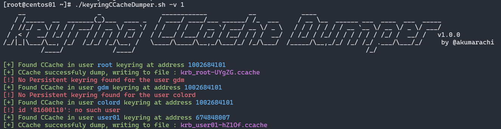

# keyringCCacheDumper
<p align="center">
        A bash script to automatically dump all kerberos secrets stored into keyring
  <br>
  <br>
</p>

 ## Abstract
On Linux systems, Kerberos tickets can be stored in different way including within the system's keyring.

The keyring provides a protected space for storing various sensitive information, including Kerberos tickets (CCache), used to authenticate users and services. This tool allows to access and dump these tickets.

> **Warning**: The tool will spawn a process as the targeted user. 
> 
> As root can switch user as he want without any credential, **running this script as root allow to dump all secrets**
> 
> **Running this script as another user than root** will **need the targeted user's password** (except for dumping self secrets)

## Feature

Without any argument the tool will retrieve all users using keyring and will attempts to dump ccache within it.

- --self:

The script will try to extract ccache from current user's keyring

- --user USER:

The script will try to exctract ccache from specific user

## How it woks
- The tool starts by examining the /proc/key-users file to identify which users are utilizing the keyring.

- Since keyring management is handled by the kernel, and each user's keyring is securely isolated, even root cannot directly access another user's keyring. To overcome this limitation, the tool switches to each identified user and accesses their keyring content.

- Once the tool has switched users, it searches through the keyring content for any Kerberos tickets and dumps them for further use or analysis.

This process allows the tool to extract Kerberos credentials stored within the keyring of multiple users, even though they are kept in separate and protected namespaces.

## Usage

```bash
chmod +x ./keyringCCacheDumper.sh
./keyringCCacheDumper.sh [-h] [-v VERBOSITY] [-u USER] [--self]
```



## Contributing

Pull requests are welcome. Feel free to open an issue if you want to add other features.
